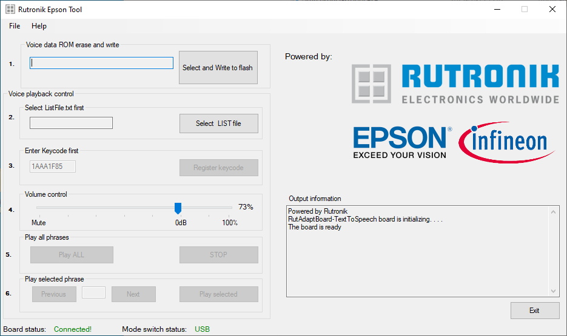

# Rutronik Flash Tool for EPSON Text-To-Speech Adapter Board
This software is for flashing and playing Epson voice files on the Text-To-Speech adapter board.

Please refer to [Rutronik Epson Flash Tool](https://github.com/RutronikSystemSolutions/TEXT_TO_SPEECH_Documents/blob/main/RutAdaptBoard-TextToSpeech_Cypress_Guide.pdf) and [RAB-Text-To-Speech](https://www.rutronik.com/rutronik-system-solutions/rutronik-adapter-board-text-to-speech) for more information and further instructions.

## Legal Disclaimer

The evaluation board including the software is for testing purposes only and, because it has limited functions and limited resilience, is not suitable for permanent use under real conditions. If the evaluation board is nevertheless used under real conditions, this is done at one’s responsibility; any liability of Rutronik is insofar excluded. 

